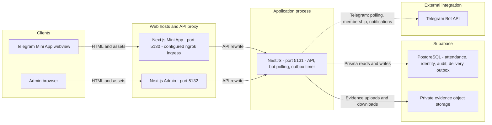
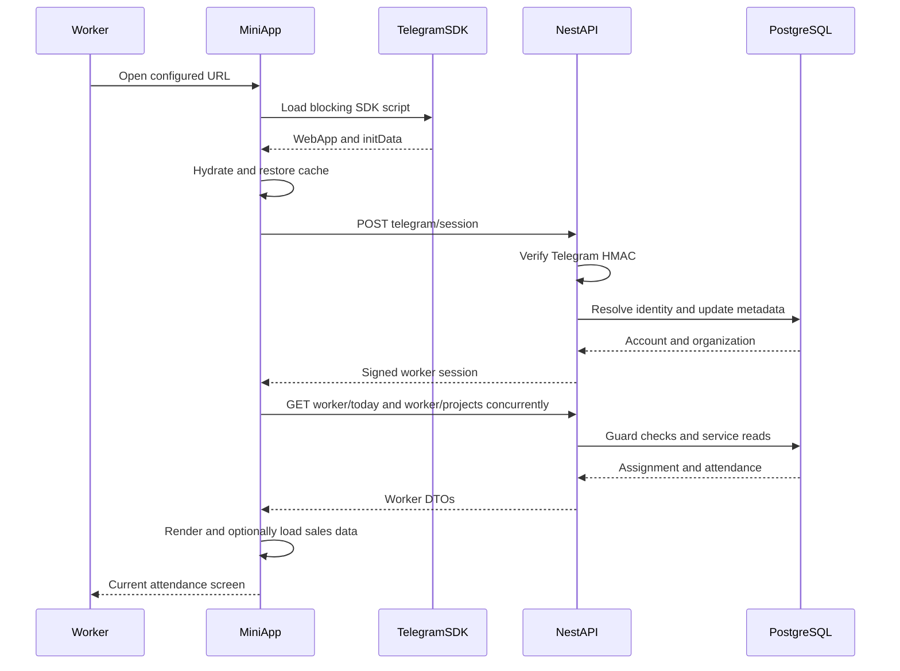
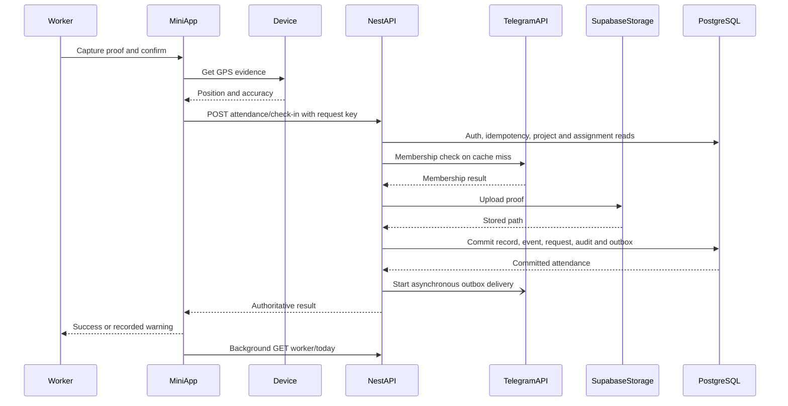

# Mini App architecture and performance audit

Date: 2 October 2026. Repository: `/Users/sonit/attendace_bot`.

## 1. Executive conclusion

The application does not need a framework rewrite on the evidence collected. It needs fewer database round trips, a non-blocking startup shell, smaller font assets, and more reliable handling of uncertain submission outcomes.

Three separate problems must not be confused:

1. **Availability:** the public Mini App URL currently configured in the root `.env` returned **HTTP 404 / ERR_NGROK_3200** in one live check. No app was listening on the normal local ports at the start of this audit. This is not slow React rendering.
2. **Data loading:** the real `getWorkerToday()` read path took **1.86–3.80 seconds**, median **1.96 seconds**, across five scoped service executions. It performed **seven SELECTs** per call. The same statements' server-side execution plans took **0.035–0.786 ms each** in a separate diagnostic pass. Repeated client/database round trips dominate the sampled read, not expensive SQL execution.
3. **First paint:** on one first visit to a fresh local app origin, the synchronous Telegram SDK request took **814.5 ms**. First contentful paint was **876 ms**. Five warm-cache loads painted in **56–76 ms**. Fonts transferred another **1,056,590 compressed body bytes** on the first visit, about 6.5 times the initial JavaScript body bytes.

The existing 20-second Mini App request timeout is already present. Increasing a Telegram long-poll duration is not a fix for attendance reads or ambiguous check-in results. Check-in saves an outbox record transactionally and starts Telegram delivery **after commit without awaiting it**. The browser can time out while server work continues, or fail in post-response UI work. These are code-supported failure mechanisms, not a reproduction of the historical screenshots.

### Scope and safeguards

- Investigation only: no application source, environment, schema, migration, bot configuration, or production records changed.
- Existing modified/untracked files were preserved. This audit report is the only new repository artifact from this investigation.
- Required engineering documents were read; `PAGE_PLAN.md` is currently missing/deleted in the working tree. README/architecture descriptions are partly stale.
- Builds ran in an isolated copy under `/private/tmp/attendance-audit-sVzcew`, using installed dependencies and freshly compiled copied contracts.
- Database probes executed SELECTs, catalog reads, and SELECT-only EXPLAIN ANALYZE. No login/session exchange, attendance submission, draft sales report creation, or Telegram message was triggered.
- No personal attendance values, coordinates, account identifiers, credentials, or Telegram initData are included here.

## 2. What the application actually is

In plain English: Telegram opens a Next.js web page. That page authenticates with your NestJS server, then asks it for the worker's current project and attendance. NestJS verifies access and reads PostgreSQL through Prisma. Photos are stored separately in Supabase Storage. Telegram messages are an additional delivery channel, not the source of truth for attendance or the mechanism that refreshes the Mini App.

| Layer | Verified implementation | Important qualification |
|---|---|---|
| Worker frontend | Next.js **15.5.25**, React **19.3.0**, App Router, Tailwind, GSAP, Lucide; port **5130** | `/` is statically prerendered, but worker data loads client-side after hydration. |
| Management frontend | Separate Next.js app; port **5132** | Shared contracts, separate auth/cache/client. Not a full admin UI benchmark in this audit. |
| Backend | NestJS **11.2.5**, Fastify adapter, `/api/v1`, port **5131** | One process contains HTTP API, bot polling, and outbox timer. |
| Database | Prisma Client **6.19.3** → Supabase PostgreSQL | Configured host is the `ap-southeast-2` shared pooler, port 5432, SSL required. |
| Photo storage | Supabase Storage REST calls, server credentials, `attendance-evidence` bucket | Browser sends a JPEG data URL through NestJS; it does not directly save attendance to Supabase. |
| Worker auth | Server verifies Telegram initData HMAC; custom HS256 session token, default seven days | Account/employee ACTIVE checks also run against DB for every protected worker HTTP request. |
| Admin auth | Organization/email/password flow, custom signed session, roles/site/project scopes | Not Supabase Auth. Default admin token lifetime is one day. |
| Telegram inbound | `getUpdates` long polling; configured timeout 20 seconds | Startup deletes an existing webhook unless polling disabled. Live Telegram registration state was not queried or changed. |
| Telegram outbound | PostgreSQL `TelegramDelivery` outbox; immediate attempt plus 30-second recovery timer | Four deliveries at a time in the retry worker; not BullMQ. |
| Realtime | No Mini App SSE, WebSocket, or Supabase Realtime subscription found | Initial load, manual/project changes, and post-action reads update the page. The one-second interval is a camera clock, not API polling. |
| Redis | Redis 7 in Docker Compose and `REDIS_URL` configuration | No Redis/BullMQ implementation found in this runtime; documentation overstates it. |
| Hosting | Local scripts and ngrok Mini App URL configuration | No app Dockerfile, Railway/Vercel/Netlify deployment manifest, or verified live production topology found. No basis to blame a hosting cold start. |

Port 5432 on the configured shared pooler is session pooling; `DIRECT_URL` is also configured to that pooler, despite its name. This is not proof of a bad configuration. Choose a connection mode based on deployment and measured connection pressure, not by blindly switching ports. [Supabase connection documentation](https://supabase.com/docs/guides/database/connecting-to-postgres).

### Folder structure and entry points

| Path / function | Responsibility |
|---|---|
| [root package.json](/Users/sonit/attendace_bot/package.json) | pnpm workspace dev/build/test/typecheck orchestration. |
| [Mini App layout](/Users/sonit/attendace_bot/apps/telegram-mini-app/src/app/layout.tsx:17) | Document, synchronous external Telegram SDK, shared page container. |
| [WorkerHomePage](/Users/sonit/attendace_bot/apps/telegram-mini-app/src/app/page.tsx:13) | 1,038-line client component: session, loading, attendance, camera, project selection, sales, feedback. |
| [Mini App request client](/Users/sonit/attendace_bot/apps/telegram-mini-app/src/lib/api.ts:44) | JSON transport, bearer token, 20-second fetch timeout, endpoint wrappers. |
| [worker-cache.ts](/Users/sonit/attendace_bot/apps/telegram-mini-app/src/lib/worker-cache.ts:1) | LocalStorage session and today data; no identity/date/expiry namespace. |
| [Mini App next.config.ts](/Users/sonit/attendace_bot/apps/telegram-mini-app/next.config.ts:1) | Same-origin `/api/v1` reverse proxy to NestJS; default loopback port 5131. |
| [globals.css](/Users/sonit/attendace_bot/apps/telegram-mini-app/src/app/globals.css:14), `public/fonts`, `font_system` | Local Kantumruy Pro and Roboto Flex assets, global typography and motion. |
| [API main.ts](/Users/sonit/attendace_bot/apps/api/src/main.ts:6), [AppModule](/Users/sonit/attendace_bot/apps/api/src/app.module.ts:24) | Fastify bootstrap, 10 MiB body limit, CORS, route prefix, global authentication/RBAC. |
| [TelegramSessionService.createSession](/Users/sonit/attendace_bot/apps/api/src/telegram/telegram-session.service.ts:19) | Verify initData, resolve account, synchronize metadata, issue session; owner fallback may create/link records. |
| [AuthGuard.canActivate](/Users/sonit/attendace_bot/apps/api/src/auth/guards/auth.guard.ts:25) | Token verification and database-backed revocation/status check. |
| [WorkerController](/Users/sonit/attendace_bot/apps/api/src/attendance/worker.controller.ts:7), [AttendanceController](/Users/sonit/attendace_bot/apps/api/src/attendance/attendance.controller.ts:36) | Validated HTTP API boundaries and worker/admin routing. |
| [AttendanceService](/Users/sonit/attendace_bot/apps/api/src/attendance/attendance.service.ts:35) | Current project, assignments, today DTO, authoritative check-in/out, evidence, geofence, transactions; 944 lines. |
| [ProjectAuthorizationService.authorizeWorkerProject](/Users/sonit/attendace_bot/apps/api/src/auth/project-authorization.service.ts:82) | Project/account/connection checks, Telegram membership, 30-second in-process cache, verification writes. |
| [PrismaService](/Users/sonit/attendace_bot/apps/api/src/prisma/prisma.service.ts:6) | One global injectable PrismaClient, startup connection and shutdown disconnect. |
| [TelegramBotService](/Users/sonit/attendace_bot/apps/api/src/telegram/telegram-bot.service.ts:15) | 1,446-line bot lifecycle, update claims, commands, registration/approval and project linking. |
| [TelegramOutboxService](/Users/sonit/attendace_bot/apps/api/src/jobs/telegram-outbox.service.ts:10), [TelegramNotifierService](/Users/sonit/attendace_bot/apps/api/src/jobs/telegram-notifier.service.ts:11) | Durable delivery intent, conditional claim, retries, storage download, Telegram photo/message API calls. |
| [SalesService](/Users/sonit/attendace_bot/apps/api/src/sales/sales.service.ts:1) | Additional sales-mode workflow; some GET operations authorize and create a draft report. |
| [Admin API cache](/Users/sonit/attendace_bot/apps/admin/src/lib/api.ts:164) | Tenant/user-keyed 60-second memory cache, five-minute stale window, in-flight GET deduplication. |
| [contracts](/Users/sonit/attendace_bot/packages/contracts/src/index.ts), [schema](/Users/sonit/attendace_bot/prisma/schema.prisma) | Shared Zod inputs/types, data model and forward migrations. Contracts are consumed through built `dist`. |
| [setup-telegram-bot.mjs](/Users/sonit/attendace_bot/scripts/setup-telegram-bot.mjs:1) | Mutating bot/menu/webhook setup tool; deliberately not run. |

`packages/config` and `docs` exist but are not evidence of extra deployed services. README still says scaffolding has not been created and describes BullMQ workers; the source supersedes those statements.

### Architecture diagram



Diagram shows the configured HTTPS same-origin path; HTTP development can use `NEXT_PUBLIC_API_URL` directly instead. Telegram's web SDK is separately fetched by the browser. Redis is intentionally omitted because the examined application does not use it. Outbox processing is inside NestJS, not a separately deployed queue worker. The ngrok ingress is currently unavailable.

## 3. Opening the Mini App: complete flow

1. A menu/reply-keyboard Web App button contains `TELEGRAM_MINI_APP_URL`; an old sent button can retain an old URL. The bot's `webAppUrl` getter and setup script configure links. No BotFather configuration was changed or assumed.
2. Next serves the prerendered root shell. This initially contains loading UI, not attendance records. Browser loads CSS, seven initial JS resources in the sample, fonts, and the synchronous `telegram-web-app.js` script.
3. `WorkerHomePage` hydrates. Its startup effect restores any cached session/today data, calls `WebApp.ready()`/`expand()`, and reads initData. It retries initData after 150 ms only if the Telegram WebApp object already exists.
4. With initData, it **awaits** `POST /api/v1/telegram/session` before new attendance/project reads, even if a cached session exists. Server checks HMAC locally, reads linked account/employee/position/organization, updates verified profile metadata, and issues the session. HMAC validation itself does not call Telegram's network API.
5. The browser starts `/worker/projects` and `/worker/today` concurrently. Each HTTP request independently runs the DB-backed AuthGuard. `getWorkerToday()` resolves employee/current project, connection, assignments/site/schedule, then today's attendance row.
6. `saveToday()` updates React state and LocalStorage. In SALES mode, `loadToday()` additionally awaits outlets and sales-day requests. Project-picker state is updated only after the surrounding Promise.all finishes.
7. `loading` clears and a GSAP entry animation runs for 420 ms with 50 ms stagger. A 3.5-second slow indicator and 6-second spinner-release timer can change the visible state before authentication/data has completed; they do not make data arrive earlier.



References: [initialization](/Users/sonit/attendace_bot/apps/telegram-mini-app/src/app/page.tsx:237), [loadToday](/Users/sonit/attendace_bot/apps/telegram-mini-app/src/app/page.tsx:331), [today service](/Users/sonit/attendace_bot/apps/api/src/attendance/attendance.service.ts:163), [session service](/Users/sonit/attendace_bot/apps/api/src/telegram/telegram-session.service.ts:19).

**What blocks the first useful screen?** On an uncached, authenticated visit: SDK availability/hydration, then session completion, then attendance data. Location and camera permissions are requested on the action path, not during initial attendance loading. `WebApp.ready()` is called before data readiness; it is not a data-loaded signal. Cached content can be shown early but currently lacks safe freshness/identity validation.

## 4. Check-in: complete save and notification flow

1. The worker captures/confirms proof. Canvas processing downsizes to at most 1,024 pixels on the longest side and creates a JPEG at quality 0.8, including the visual watermark. This is synchronous main-thread work; device cost was not measured.
2. `handleAttendanceAction()` requests high-accuracy location with a 20-second timeout and 10-second allowed cached position age. It generates a new UUID for that attempt.
3. Browser posts photo data URL, location evidence, and `Idempotency-Key`. Server AuthGuard verifies token and current account. Controller validates the shared Zod schema and key.
4. `AttendanceService.checkIn()` checks the scoped idempotency record, then resolves current project and assignment. Unlike `getWorkerToday()`, this action invokes `authorizeWorkerProject()`.
5. Project authorization performs three parallel ORM lookups. A cache miss calls Telegram `getChatMember` and writes verification status in an interactive transaction. The membership fetch has no explicit timeout. An authorized cache hit skips those writes, not the initial lookups.
6. Server uses its own timestamp and site timezone, checks existing attendance, uploads the photo to Supabase Storage, and evaluates geofence/reliability/schedule status. Photo upload has no explicit timeout. An additional employee lookup prepares the Telegram caption.
7. One DB transaction writes/updates AttendanceRecord, appends AttendanceEvent, records AttendanceRequest, writes AuditLog, and upserts TelegramDelivery. Unique assignment/date and scoped request keys enforce server idempotency/concurrency protection. Transaction options are **15 seconds maxWait / 35 seconds timeout**; these are limits, not measured normal durations.
8. After commit, API starts `processDeliveryById()` without awaiting it and returns the attendance result. Outbox sends/downloads evidence separately and records delivery state; its retry scanner runs every 30 seconds.
9. Browser invokes Telegram haptics, shows success/warning, and starts `loadToday()` in the background. It does **not** immediately update the attendance card/action state from the returned authoritative result.



The outbox arrow abbreviates storage download, conditional DB claim, Telegram request and delivery status writes. Response and notification completion are not ordered; Telegram may show a message even when the phone lost the HTTP response.

References: [client action](/Users/sonit/attendace_bot/apps/telegram-mini-app/src/app/page.tsx:384), [checkIn](/Users/sonit/attendace_bot/apps/api/src/attendance/attendance.service.ts:246), [post-commit dispatch](/Users/sonit/attendace_bot/apps/api/src/attendance/attendance.service.ts:413), [transaction](/Users/sonit/attendace_bot/apps/api/src/attendance/attendance.service.ts:431), [membership](/Users/sonit/attendace_bot/apps/api/src/auth/project-authorization.service.ts:82), [outbox](/Users/sonit/attendace_bot/apps/api/src/jobs/telegram-outbox.service.ts:19).

### Why a successful Telegram message can coexist with an error banner

Confirmed code conditions, with historical occurrence still unverified:

- The browser aborts waiting for response headers at 20 seconds; this does not cancel the server transaction or later notification. The server's allowed work can exceed that budget.
- A haptic bridge exception occurs inside the same try/catch as the successful API response, before the success banner, and is converted into `requestFailed`.
- `loadToday({preserveFeedback:true})` still replaces feedback for some missing-project/assignment cases. It swallows errors internally, so the caller's `.catch()` does not control these cases.
- A timeout is treated as definite failure, not “outcome unknown; checking your saved attendance.” A retry generates a new idempotency key rather than resuming the same logical operation.
- No immediate attendance-state reconciliation means the old check-in button/card can remain until another multi-second read completes.

These are higher-value fixes than simply increasing every timeout. Keep “saved attendance,” “warning about location,” “refresh failed,” and “Telegram delivery pending” as distinct states.

The bot's `getUpdates(timeout=20)` is for incoming bot events, not the browser's check-in HTTP response. Long polling and webhooks are alternative inbound transports; neither is a Mini App state subscription. [Telegram Bot API](https://core.telegram.org/bots/api#getupdates).

## 5. Measurement method and baseline

### Environment and conditions

- Local macOS arm64, Node **26.6.0**, pnpm **9.15.0**; documentation suggests Node 22 LTS, so deployment runtime parity is unverified.
- Current dirty working-tree source, not merely HEAD. Isolated source copy, no dependency installation/upgrades, no root `.env` copied into frontend builds.
- Contracts rebuilt first. Mini App built with default same-origin/proxy configuration; this is not proof of the environment used by the broken public URL.
- Initial Mini build/API build/tests ran concurrently; build wall time is indicative, not a controlled compiler benchmark.
- Production Next served only on `127.0.0.1:15130`. Diagnostic Nest server used `127.0.0.1:15131`, compiled modules, test-mode lifecycle, dummy local session secret, no bot token, polling disabled and health sync disabled. No worker tokens were manufactured.
- Browser: Codex in-app Chromium **154**, **1280×720**, no mobile emulation, CPU throttling or network throttling. Anonymous Telegram-required screen, not the authenticated worker dashboard.
- One first visit to a fresh app origin (`localhost`), followed by five normal reloads with browser cache enabled. “First visit” is not a guaranteed empty OS/DNS/third-party cache. SDK timings remain visible; cross-origin byte counts are unavailable without Timing-Allow-Origin.
- Read-only DB calls used the configured remote Supabase connection and one internally selected active linked worker with current project. Returned data/identity stayed in memory and was not logged. Service replays do not include HTTP, AuthGuard, browser or Telegram auth.
- Samples are too few for a credible p95/p99 or concurrency capacity claim. Medians and observed ranges are reported instead.

### Performance baseline table

| Measurement | Samples | Result | What this does / does not establish |
|---|---:|---|---|
| Contracts build | 1 | Pass | Fresh copied contracts compile. |
| Mini App production build | 1 primary | **6.53 s wall**, compile step **1.838 s** | Static `/`; type/lint build checks pass. Warm instrumentation rebuild also passes. |
| API production build | 1 | **3.63 s wall**, pass | Compiled API; not a full production deployment. |
| API tests | 1 run | **25 files, 161/161 passed**, **1.45 s** runner duration | Mocked unit/service coverage; not live Telegram/phone correctness. No Mini App test script found. |
| Initial route JavaScript | 1 build | **162 kB** First Load JS; route **60.3 kB**, shared **102 kB** | Next build report, not the total page transfer. |
| Initial JS observed in browser | 1 first visit | **7 files; 163,154 encoded body bytes; 563,654 decoded bytes** | Excludes external Telegram SDK, lazy camera chunks, audit script and HTML. |
| Initial CSS | 1 first visit | **5,432 encoded / 23,294 decoded bytes** | Production resource timing. |
| Active fonts | 1 first visit | **1,056,590 encoded / 1,881,656 decoded bytes** | Roboto Flex and Kantumruy Pro together. Unused italic file is not counted. |
| Production HTML total HTTP time | 5 | median **4.20 ms**, range **3.55–32.25 ms** | Node fetch, loopback, headers and decompressed body; not useful attendance data readiness. |
| Fresh-origin browser FCP / observed LCP | 1 | **876 ms / 1,088 ms** | Anonymous screen; LCP candidate captured through load + 2 s, not a field Core Web Vitals percentile. |
| Fresh-origin Telegram SDK request | 1 | **814.5 ms** | Starts at 10.8 ms; DCL 889.5 ms; matches blocking-script source. |
| Warm-cache FCP | 5 | median **60 ms**, range **56–76 ms** | Desktop anonymous shell; no authentication or DB wait. |
| Warm-cache observed LCP | 5 | median **220 ms**, range **208–244 ms** | Same scope and 2-second observation window. |
| Long tasks / layout shifts | 6 measured page visits | No long-task entries or layout-shift entries observed | Does not cover authenticated UI, camera, low-end phones or full-session INP. |
| Diagnostic Nest startup | 1 | **2,056.7 ms** after imports | Includes app construction/DB initialization; jobs disabled. Not hosting cold-start telemetry. |
| API health total HTTP time | 5 | median **0.59 ms**, range **0.55–5.37 ms** | HTTP 200; health handler does not check DB. |
| Unauthorized worker/today HTTP | 5 | **0.34–0.71 ms**, HTTP 401 | Authentication-denial path only; not an attendance response benchmark. |
| Prisma initial connection | 1 | **2,261.39 ms** | Connection/handshake from this machine. |
| `SELECT 1` client wall time | 5 | median **353.65 ms**, range **256.08–609.80 ms** | Strong evidence of connection/network/pool/round-trip overhead; not pure PostgreSQL execution. |
| Worker guard-equivalent SELECT | 5 | median **257.32 ms**, range **256.74–522.59 ms** | One account/active-employee query; excludes local token verification. |
| `getWorkerToday` service replay | 5 | median **1,958.58 ms**, range **1,862.37–3,804.20 ms** | Seven SELECTs; one sample also emitted an extra driver-level query event. Guard excluded. |
| `listConnectedProjects` service replay | 5 | median **814.26 ms**, range **785.47–1,549.37 ms** | Three SELECTs; guard excluded. |
| Exact today SELECT plans | 7 statements, one diagnostic pass | Execution **0.035–0.786 ms** each; planning **0.058–0.265 ms** | EXPLAIN executes read queries; plans are warm/sample-specific, not table-growth guarantees. |
| Applied migration catalog | 1 | **23 completed entries** | Expected read-path/index/update-dedupe migrations present. Not a complete schema-drift audit. |
| Configured public Mini App URL | 1 | **404 / ERR_NGROK_3200**, **375.8 ms** | Current reachability failure. No tunnel/bot mutation performed. |
| Authenticated Telegram launch/check-in, GPS, photo upload, mobile INP | 0 live mutation runs | **Unverified** | Requires a legitimate device session and an approved isolated test organization/database. |

### Exact query breakdown

`getWorkerToday()` has four main ORM stages but Prisma's relation reads expand them into seven SELECTs:

| Order | Query responsibility | Client query time in final diagnostic pass | PostgreSQL execution time |
|---:|---|---:|---:|
| 1 | Employee/current project ID | 591 ms | 0.041 ms |
| 2 | Current Project relation | 507 ms | 0.041 ms |
| 3 | WorkerProject connection | 508 ms | 0.035 ms |
| 4 | Assignment with active site/project predicate | 511 ms | 0.078 ms |
| 5 | Site relation | 508 ms | 0.038 ms |
| 6 | WorkSchedule relation | 508 ms | 0.037 ms |
| 7 | AttendanceRecord by assignment/date | 508 ms | 0.786 ms |

EXPLAIN was performed after capturing those statements, so execution times are not the internal execution component of the exact same network sample. Nevertheless, both the near-constant client duration and sub-millisecond server plans strongly support reducing round trips before adding indexes. Prisma query events were captured without printing SQL parameters; the public mechanism is documented in [Prisma v6 logging](https://www.prisma.io/docs/orm/v6/prisma-client/observability-and-logging/logging).

The observed ~255 ms warm floor means seven dependent reads alone can approach 1.8 seconds; authentication and the prior session exchange add more. This is an explanatory model, **not a measured end-to-end mobile duration**. Geography, pooler behavior, prepared statement round trips and network conditions may all contribute; the audit did not isolate each contribution.

An aggregate pg_stat_activity snapshot showed one active query and otherwise idle/background connections, with no observed lock wait. It does not reproduce the earlier P2028 transaction-start timeout or exclude pressure during concurrent use.

### Raw repeated samples

All durations below are milliseconds, in chronological sample order, including first-run effects:

```text
SELECT 1 wall:       609.80, 257.61, 353.65, 256.08, 363.01
Guard read wall:     522.59, 257.32, 256.97, 257.73, 256.74
Worker today wall:  3804.20,1862.37,1958.58,2182.95,1869.59
Worker projects:   1549.37, 786.13, 814.26, 785.47, 859.22
Local HTML total:     32.25,   3.55,   4.20,   5.73,   3.63
Local health total:    5.37,   0.85,   0.55,   0.55,   0.59
Warm browser FCP:    60, 68, 60, 76, 56
Warm observed LCP:  220,220,208,244,208
```

## 6. Ranked bottlenecks and risks

Evidence labels: **Measured** = current runtime observation; **Code-confirmed** = directly follows from implementation; **Suspected** = impact/occurrence still needs a targeted trace. Effort estimates are engineering estimates, not commitments: S roughly half–one day; M two–four days; L multi-stage work including environment/testing.

| Rank | Finding / evidence | Affected code | User impact | Proposed fix after approval | Effort / risk |
|---|---|---|---|---|---|
| 0 — availability gate | **Measured:** configured ngrok endpoint is offline | Root environment; bot `webAppUrl`; setup script; Mini proxy config | Some buttons cannot open any application | Establish one stable HTTPS origin, verify app/API reachability and every menu/keyboard entry point. Do not assume updating config rewrites old sent buttons. | S locally / M stable hosting; medium operational risk |
| 1 — high | **Measured:** seven sequential today SELECTs; median 1.96 s service time, sub-ms server plans | `AttendanceService.resolveCurrentProject`, `resolveWorkerAssignments`, `getWorkerToday`; `listConnectedProjects`; AuthGuard | Multi-second wait after authentication, slow post-save refresh | Consolidate tenant-scoped read model using explicit joins or a version-compatible Prisma relation strategy; select needed fields, restrict assignment to current project; benchmark an API host near the DB. Preserve account checks. | M; medium correctness/security risk |
| 2 — high | **Code-confirmed:** startup awaits session, then today/projects; session updates metadata on every launch; SALES adds another dependent round | `page.tsx:initSession/loadToday`, `TelegramSessionService`, `SalesService` | Empty spinner despite fast static HTML; more work on repeated opens | Return essential initial data with the verified bootstrap where useful; avoid unchanged profile writes; separate shell/attendance/sales loading states. Keep server initData verification. | M; medium auth/cache risk |
| 3 — high | **Code-confirmed mechanism; historical incident unverified:** 20 s client vs longer/unbounded server path, haptic errors share mutation catch, UUID changes on retry | Mini `api.ts`, `handleAttendanceAction`, `loadToday`; project authorization and photo upload; attendance transaction | “Cannot submit” after save, stale button, repeated retries | Reconcile UI from authoritative response; isolate haptics/refresh failures; preserve one operation key through retries; represent timeout as unknown and query saved state; instrument/bound dependency budgets. Keep outbox async. | M; high attendance integrity risk if mishandled |
| 4 — medium/high | **Measured + code-confirmed:** SDK request 814.5 ms with parser-blocking script | `layout.tsx:24`; startup effect | Cold first screen depends on external SDK network | Load bridge without blocking shell, with explicit SDK readiness/error state and verified initData gating. Do not blindly add async while retaining the 150 ms assumption. | S–M; medium Telegram integration risk |
| 5 — medium | **Measured:** 1.06 MB compressed font body; TTF assets `Cache-Control: public, max-age=0` | `globals.css`, `public/fonts`, source font assets | Expensive first download on mobile connections | Produce licensed WOFF2 assets from supplied fonts, remove unused axes/glyph ranges carefully, preserve Khmer shaping, use hashed/versioned long-lived assets. Keep both requested font families. | S–M; low/medium visual regression risk |
| 6 — high correctness, secondary performance | **Code-confirmed:** global LocalStorage keys without expiry, identity, organization or day validation | `worker-cache.ts`, startup effect | Old worker/day may flash, stale controls, invalid session request; “instant” but potentially wrong screen | Version/namespaced cache keyed to verified identity and site date, explicit freshness and logout/identity-change invalidation. No shared cached authorization. | M; medium privacy/auth risk |
| 7 — medium reliability | **Code-confirmed:** webhook lacks @Public while AuthGuard is global; startup deletes webhook; polling processes updates serially; offset advanced before handler success | `telegram-webhook.controller.ts`, `telegram-bot.service.ts`, setup script | Webhook mode cannot work as intended; slow updates queue; failed handled updates can be acknowledged on next poll | Choose one mode explicitly. In webhook mode exempt app-session auth only alongside mandatory Telegram secret verification and durable update acceptance. In polling mode acknowledge only persisted processing/retry state; prevent duplicate runners. | M; high security/delivery risk |
| 8 — medium observability | **Code-confirmed:** interceptor begins after guards; health returns OK without a DB readiness check | `http-latency.interceptor.ts`, `auth.guard.ts`, `health.controller.ts`, `PrismaService.onModuleInit` | Logs understate real request latency and can claim health despite failed DB initialization | Add safe request-level timings from Fastify ingress, phase spans/query counts and separate readiness; never log tokens/locations/raw SQL params. | S–M; low risk |
| 9 — medium maintainability; CPU impact suspected | 1,038-line client page, ~30 state variables, camera timer updates parent; only two small camera views lazy-loaded; GSAP eager | `page.tsx`, camera components; large attendance/bot services | Hard to test feedback/state transitions; potential rerender cost on low-end devices | Extract session/data/action/camera hooks and state-machine boundaries; isolate live camera clock; lazy-load actual optional features. Profile React before memoization. | M; medium behavior-regression risk |
| 10 — growth risk, not current measured cause | Several list reads unpaginated; sales-day GET performs authorization writes and may create report; admin cache exists but invalidates globally on mutations | `AdminService.listEmployees/listSites/listAssignments`, `getTodayAttendanceForAdmin`, `SalesService.getWorkerSalesDay`, admin client | Increasing payload/query contention with more workers/visits; GET has hidden work | Bound lists/cursor pagination and separate read from draft creation; targeted invalidation; load nonessential sales/project-picker data on demand. | M; medium API-contract risk |

### Important additional correctness observations

- `resolveWorkerAssignments()` returns all of this worker's active assignments if none match the current project. It remains employee/organization scoped, but can mix a chosen project with another project's assignment/site. Fix only with explicit tests and product decisions; do not silently change attendance history.
- Multiple organization accounts for one Telegram user are resolved by a first-match/currentProject heuristic, without an explicit selection/order guarantee. This complicates safe caching and bootstrap identity. This is not a demonstrated cross-tenant exploit.
- Session, current-project and sales paths contain fallback branches for different Prisma/mock method shapes. These obscure runtime guarantees and make unit tests easier to pass without exercising real query plans.
- `PrismaService` catches a startup connection failure and continues. Existing `/health` is liveness, not readiness.
- `NEXT_PUBLIC_TELEGRAM_MINI_APP_URL` is unset in the root environment while server `TELEGRAM_MINI_APP_URL` is set. They configure different things. The root dev script does not explicitly load root `.env` into all child apps, and no app-local `.env` files were found. How the earlier user shell injected environment remains unverified; document one launch procedure.

## 7. Architecture evaluation

### Keep

- NestJS as the authoritative security/business boundary; server-owned time, geofence and final attendance status.
- Shared validated contracts and separate worker/admin surfaces.
- Transactional attendance facts, append-only event/audit intent, idempotency constraints.
- Durable PostgreSQL outbox rather than waiting for Telegram before returning success.
- Single shared Prisma client rather than constructing one per request.
- Existing admin in-flight dedup/cache and the absence of photo-signing fan-out on worker/today.

### Simplify

- The worker page currently mixes bootstrap, persistence cache, device capture, attendance, sales editing, animations and feedback. Extract along responsibilities, not arbitrary line counts. Component splitting alone does not reduce the seven database reads.
- Attendance logic and bot commands share a tightly coupled service graph; external membership/storage calls sit on the mutation's critical path. Define timeout/retry contracts and separate domain save state from notification state.
- The current data model requires several project/site/assignment lookups before showing one screen. A compact read DTO can keep that model while eliminating redundant fetch stages.
- Remove stale documentation assumptions about Redis/BullMQ/Realtime. Do not add those systems merely because docs mention them.
- Do not introduce a client cache that skips authorization to appear fast. Cached UI must be clearly stale until verified; fresh data remains tenant/worker scoped.

### What remains only suspected

No current evidence proves that React reconciliation, geolocation on first load, oversized JavaScript, missing indexes, a Supabase outage, database locking, hosting cold starts, or a 20-second long-poll interval is the main cause. The API already has important indexes, and this sample's SQL executes quickly. Font transfer and the external script are stronger first-load evidence than a framework-change theory.

No authenticated React Profiler session or low-end Android trace was collected. No concurrent load test was run against production. The older 4–15 second logs are historical observations, not new benchmark results.

## 8. Recommended order of work

### Immediate, narrowly scoped changes after review

0. Restore reachability of the intended HTTPS Mini App origin and verify all launch buttons; keep this distinct from performance optimization.
1. Add end-to-end request timing and reduce the worker read path's round trips. Preserve tenant scope, active-account validation and site-date correctness.
2. Fix outcome handling: authoritative response updates state immediately; haptics and refresh never convert success into failure; timeout triggers reconciliation using the original idempotency key.
3. Remove parser-blocking SDK dependence from the shell, with an explicit readiness gate for authentication. Optimize local font format/weight/script payload without replacing requested fonts.
4. Make caches identity/date-aware; separate attendance readiness from project-picker and sales readiness.
5. Add Mini App tests for timeout-after-commit, refresh failure, duplicate tap, haptic failure, expired cache and identity switch. Current 161 passing API tests do not cover these browser states.

### Longer-term changes, only if measurements justify them

- Benchmark a continuously running API near the Supabase region, compare network and pool timings, then choose host/connection mode. Do not migrate the database or enlarge pools from speculation.
- Give bot inbound processing one explicit owner or dedicated worker deployment if scaling the HTTP API. Separate outbox workers only when throughput/recovery requirements justify it; PostgreSQL outbox can remain.
- Evolve worker bootstrap/read DTOs and bounded admin/report lists; avoid proliferating microservices.
- Introduce SSE/realtime only for demonstrated cross-device/approval update requirements. Post-save local state should not wait for a webhook or subscription to confirm a response already received.
- Add staged device/network performance budgets and privacy-safe production telemetry before broad UI decomposition.

### Three highest-priority implementation actions and acceptance checks

Availability is a prerequisite; among code/performance work:

| Action | Proposed verification / acceptance target, not an achieved result |
|---|---|
| **1. Collapse the attendance read path and instrument full request time** | Capture query count and wall time before/after on the same DB/host/worker fixture. Aim for no more than three core read SELECTs where feasible, while retaining guard checks. Run at least 20 sequential samples and controlled staging concurrency; report median/p95. Require a meaningful median improvement (initial target ≥50%), correct no-assignment/ambiguous/timezone behavior, and tenant isolation tests. Separately compare co-located API timing before deployment decisions. |
| **2. Make check-in outcomes reliable under slow/lost responses** | Staging test: commit succeeds but delay/drop response beyond 20 s; retry same key; verify exactly one record/event intent and no duplicate delivery intent. Force haptic exception and refresh 500; confirmed success must stay success. Verify card/button changes from authoritative DTO without waiting for GET. Explicitly test warning vs failure. |
| **3. Remove avoidable first-render network blocking** | Five cache-disabled and five warm tests on a real mid-range Android device using identical throttling. Record SDK time, FCP, observed LCP, attendance-ready mark, long tasks, JS and font bytes. Shell must paint even if SDK is delayed; verified login must still wait safely. Set a provisional ≥50% reduction in compressed font bytes and validate Khmer shaping/Roboto Flex 500 visually. |

Use an explicit SDK load strategy/readiness lifecycle rather than the current plain blocking tag; Next provides script-loading strategies. Local font loading/optimization can be implemented with existing assets, without switching typography. Verify against the installed Next 15 APIs before implementation; current general guidance is in [Next scripts](https://nextjs.org/docs/app/guides/scripts) and [Next fonts](https://nextjs.org/docs/app/getting-started/fonts).

## 9. Reproduction and remaining measurement steps

### What was run

All builds below were in the isolated copy, not over the existing `.next` or API dist:

```bash
pnpm --dir /private/tmp/attendance-audit-sVzcew/packages/contracts run build
pnpm --dir /private/tmp/attendance-audit-sVzcew/apps/telegram-mini-app run build
pnpm --dir /private/tmp/attendance-audit-sVzcew/apps/api run build
pnpm --dir /private/tmp/attendance-audit-sVzcew/apps/api test
```

Diagnostic artifacts remain temporarily in that directory:

- `db-profile.mjs`: five SELECT/service timing samples, safe catalog output, no returned worker DTO logging. Uses the repository's `.env` privately for DB connection only.
- `db-plans.mjs`: captures actual today SELECT statements/parameters in memory and runs read-only EXPLAIN, printing only timings/root plan types and aggregate connection states. The first attempt failed on the date binding after six plans; a corrected typed-date pass completed all seven. Failed diagnostic time is not included in the successful baseline.
- `api-profile-server.mjs`: loopback Nest server with background jobs disabled and a non-production session secret, used only for health/401 reads.
- Copied Mini `public/audit-metrics.js` and one extra deferred script tag in the **copied** layout: PerformanceObserver for buffered LCP/long-task/layout-shift plus resource/navigation timing. Outputs JSON to a hidden DOM node at load + 2 seconds; does not transmit telemetry. Adds 719 compressed body bytes and minor observer overhead. Build JS route size stayed 162 kB.

The browser inspection API did not expose `performance`, so this explicitly disclosed temporary instrumentation was used instead. Both temporary servers were stopped after collection. No source instrumentation remains in the actual application.

### Safe commands for repeat read diagnostics

These need authorized DB read/network access and will connect to the configured database. They do not need bot credentials and do not write attendance:

```bash
cd /private/tmp/attendance-audit-sVzcew
node db-profile.mjs
node db-plans.mjs
```

For local HTTP overhead only, run the diagnostic server in one terminal, then query it in another. Do not mistake this server's test-mode health latency for production attendance latency:

```bash
cd /private/tmp/attendance-audit-sVzcew
node api-profile-server.mjs
curl --silent --output /dev/null --write-out 'status=%{http_code} ttfb=%{time_starttransfer} total=%{time_total}\n' http://127.0.0.1:15131/api/v1/health
```

Stop the diagnostic server with Ctrl-C when finished. Do not use ordinary `pnpm dev` as a read-only profiler against live credentials: bot startup can delete webhooks/set menu buttons and outbox workers can write/send messages.

### What to measure next with an approved staging account

1. Create/use a dedicated staging organization, bot, storage bucket and database with representative synthetic assignment/attendance volumes. Do not replay mutations into production for a benchmark.
2. Launch the configured Mini App through Telegram on the target Android phone. Use a legitimate Telegram session; never copy initData/bearer tokens into reports. Clear only that test app's site storage for cold tests, and distinguish asset-cache-cold from identity-cache-cold.
3. Record five cold/five warm navigations initially. Add 20+ samples for percentile comparisons. Capture a sanitized waterfall and explicit marks: navigation → shell → SDK ready → session response → today response → attendance rendered. Verify one session exchange and expected GETs per production mount.
4. Add staging server spans from Fastify ingress through guard, session lookup/update, project authorization, each Prisma call, storage, transaction wait/commit and response completion. Log request IDs and aggregate durations only. Never log Telegram request URLs containing tokens or query parameters containing identities/coordinates.
5. Record a React Profiler/Performance trace with camera closed, camera open for ten seconds, and a test proof capture. Check parent commits caused by the one-second clock and synchronous canvas/JPEG work. Only then choose memoization/lazy boundaries.
6. Run one normal staged check-in, a delayed/lost-response test, duplicate-tap test and a failed-refresh test using a fixed logical idempotency key. Correlate API commit and outbox delivery by safe test request ID. Verify UI state and database uniqueness, not merely a Telegram message.
7. Inspect staging DB query plans with production-like synthetic volumes, connection limits, pool queue time and transaction waits under bounded concurrency. Compare the API host's region with the DB. The current idle snapshot cannot establish a saturation limit.
8. Inspect the actual hosting deployment's process manager/region, restart/idle policies, proxy timeouts and logs. Measure first request after an approved staging restart separately from warm requests. Do not infer cold starts from framework dev compile logs.

## 10. Audit completion and decision

Investigation and baseline are complete within the read-only boundary. Production Mini App and API builds passed, all 161 API tests passed, actual read-only Supabase query timings/plans were measured, and a production browser shell was profiled. No live attendance write or authenticated phone success claim is made.

The Mermaid maps use the diagram skill's source-grounded structure, kept locally rather than published to Figma. The recommended next step is a small, testable read-path/outcome-handling change—not a redesign, new framework, or wholesale database migration.
